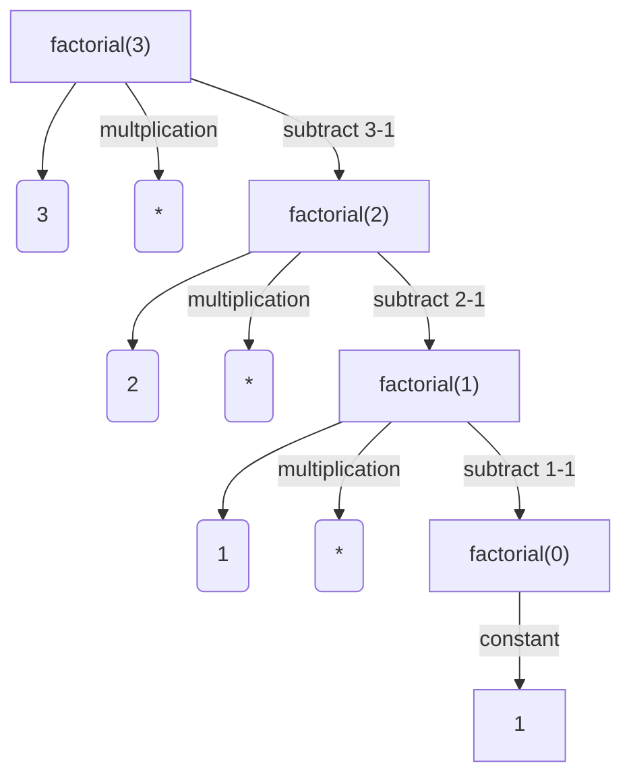
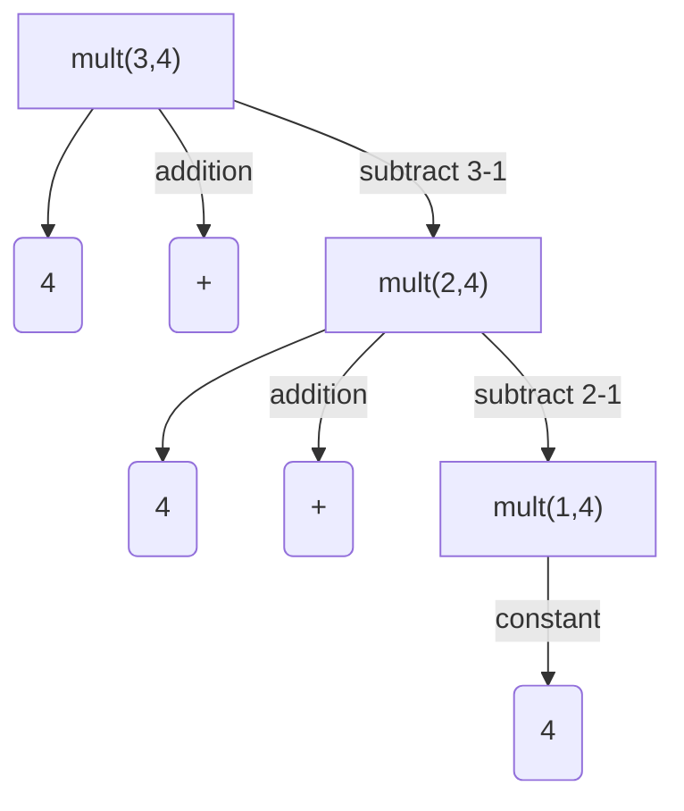
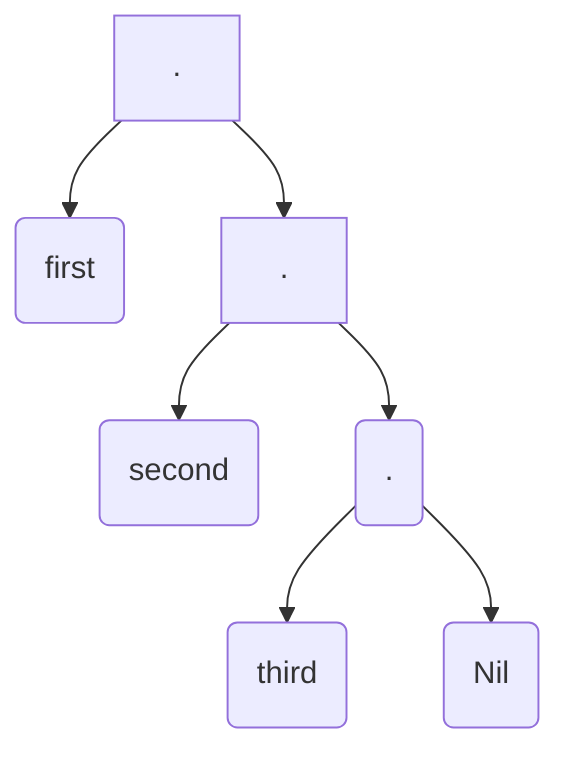

+++
title = "Understanding Lisp: Part 1"
description = "Some notes on the history and origins of the Lisp programming language."
date = "2019-09-29"
categories = ["programming languages","lisp","recursive functions","eval"]
mmark = true
draft = false
+++

<span style="color:red">
*Note: this post is still in progress. When I started writing these notes
several months ago, I quickly realized that it is very difficult to
describe the Lisp language and McCarthy's original paper on Lisp
without going deep into details (during my initial attempt to write a cursory
overview of Lisp, I also realized that there were many
aspects of the language and its history that I never truely
understood). Posting these notes in an unfinished version is meant to
serve as a forcing function to get me to finally finish this article,
since it has remained dormant in the past month.  I hope
that, even in its current unfinished form, it still provides some
interesting insight.*
</span>


I've been slowly making my way  through John McCarthy's seminal paper
on Lisp,  [*Recursive Functions of Symbolic Expressions: Their
Computation by Machine, Part 1*](http://www-formal.stanford.edu/jmc/recursive.pdf). It
was only after a week or so of digesting the content that I started to
understand the significance of his ideas and the broader context within which the Lisp programming language was developed. In this article, I will attempt to summarize what I've learned so far about the history and development of this fascinating programming language.[^1]

In trying to understand the Lisp language and its origins, I think it
helps to ask two separate questions. First, why is a language or a
*formalism* such as Lisp (as we discuss, Lisp is much more than
simply a programming language) needed or desirable? Answering this
question first requires considering the  shortcomings of the
programming languages available at the time when McCarthy started his
work, as well as the theoretical motivations that prompted McCarthy to
work on Lisp in the first place.  These topics are addressed in the
first Section, and center around the topic of **recursive functions
and programming**, which are fundamental to the design and spirit of
Lisp and many subsequent programming languages in the *functional
programming* tradition. The second question is: what is the nature of
the actual Lisp language that McCarthy and his colleagues first
proposed and implemented, and what, if anything, is special about it?
The topic is discussed in the second section, with a focus on the Lisp **eval** function and the idea of **self interpreting code** (both of which were initially theoretical ideas that even McCarthy, at the time of writing his article, didn't realize had many practical applications in programming language design).

# Lisp the Idea

## The Historical Context and Recursive Programs

First, a rather obvious point about the historical context: Lisp was
developed during a time when only a few modern programming languages
existed (specifically, during the late 1950s). The conventional wisdom
is that Lisp is the second oldest programming language in continuous
use behind Fortran. While it's hard to find a readable and concise
code example involving earlier versions of Fortran,  a good starting
point is to consider the following program in a modern version of
Fortran: [^2]
```fortran

PROGRAM MAIN
      INTEGER N, X
      EXTERNAL SUB1
      COMMON /GLOBALS/ N
      X = 0
      PRINT *, 'Enter number of repeats'
      READ (*,*) N
      CALL SUB1(X,SUB1)
      END

      SUBROUTINE SUB1(X,DUMSUB)
      INTEGER N, X
      EXTERNAL DUMSUB
      COMMON /GLOBALS/ N
      IF(X .LT. N)THEN
        PRINT *, 'x = ', X
        X = X + 1
        CALL DUMSUB(X,DUMSUB)
      END IF
      END
```

This program, which takes a given number \texttt{N} from a user prompt
and prints all intermediate numbers using a variable $\texttt{X}$ a
subroutine $\texttt{SUB1}$, is implemented in Fortran 77, which became
the Fortran standard in 1978 (nearly twenty years after Lisp). The
details of this program are not important. What is important is the
part that involves the second argument to $\texttt{SUB1}$ called
$\texttt{DUMSUB}$. When this subroutine is called,  as shown below:
$$\small
\texttt{CALL SUB1(X,SUB1)}
$$
he second argument is the actual function $\texttt{SUB1}$. As discussed in the article cited above, Fortran 77 (in contrast to later versions of Fortran such as Fortran 90 and 95) does not fully support recursion (i.e., the ability for a function to call itself); a function in Fortran 77 can only make a recursive call if it calls itself as an argument. 

To illustrate recursion a bit more, the code below shows two versions
of this same function in the
[Python programming language](https://www.python.org/), a recursive
version ($\texttt{recursive\_version}$, where the function calls
itself on line 6) and a non-recursive version
($\texttt{non\_recursive\_version}$, which instead uses a while
loop). In the former case, we get rid of the need to change *the
state* or value of the variable $\texttt{x}$, and instead call the
function directly with $\texttt{x + 1}$.
```python
N = 10

def recursive_version(x):
	if x < N: 
        print("x = %d" % x)
	    recursive_version(x+1)
	
def non_recursive_version(x):
    while x < N:
        print("x = %d" % x)
        x += 1

recursive_version(0)
non_recursive_version(0)
```
Casual users of Python may only rarely encounter recursion and instead
choose to always write their functions in the second *iterative* or
*imperative* style (in this case, we mutate the value of $\texttt{x}$
during each pass in the $\texttt{while}$ loop). In fact, there are
good reasons for avoiding recursion in languages such as Python; if
you change the value $\texttt{N}=2000$, for example, Python will raise
a $\texttt{RuntimeError}$ and complain that you have exceeded a
$\texttt{maximum recursion depth}$ (this is related to certain internal
properties of how Python is implemented that we won't delve into here;
see [here](https://realpython.com/python-thinking-recursively/) for a
more general discussion of recursion in Python).

## Recursive Functions: Some Theoretical Perspective

The point of the examples above is that recursion is not an essential
part of classical imperative programming; this is reflected in the
shortcomings of the languages discussed above, languages which  came
into existence  long after McCarthy's initial work on Lisp (case in
point: in Fortran 77, which again came out nearly 20 years after Lisp,
function recursion is not directly supported). In Lisp, however,
recursion is not only well supported, but it is fundamental to the
design and spirit of the language. This is perhaps one main reason why
the language is hard to grasp. What's more, the motivation for using
recursion (especially in McCarthy's original work) is related to
theoretical considerations that are not likely to be understood by
many programmers. This is precisely the topic I intend to explore a
bit more in this section.

Before getting into the theoretical motivations, let's ensure that we
have the correct intuitions about recursion by looking again at an
example in Python.  This example is a naive implementation of the
factorial function $n!$, which takes a positive integer $n$  and
returns the product of $1 \times 2 \times ... \times n$. For example,
$6! = 1 \times 2 \times 3 \times 4 \times 5 \times 6 = 720$.  The
factorial function is a classic recursive function, which can be
expressed as the following *recurrence* (or recursive definition):
$$\small
n!=n \times (n-1)!
$$
This can be implemented directly in the Python program shown below (again, we have to be careful not to make $N$ too large in order to avoid exceeding the maximum recursion depth):
```python
N = 10

def factorial(n):
    if n == 0:
        return 1
    return n * factorial(n - 1)
    
factorial(N)
```
I find it helpful to visualize the program above (and recursion more
generally) using a tree representation, such as the one shown below
(where  $N=3$):



Here we can see that $\texttt{factorial}$ continues to be called until we reach a  zero point, at which point $1$ is returned ) and  multiplication is incrementally applied over the remaining numbers (or *leaf nodes*) in the tree (i.e., $1,2,3$).  One important thing to observe  is that we have explained away the factorial function in terms of three much simpler operations, namely **multiplication**, **subtraction**  and **returning 1** (or what is sometimes referred to as the $\texttt{constant}$ function). In other words, if we are concerned about whether the factorial function will reliably give us a solution for any number $N$, we can be reassured by seeing through its recursive definition that it relies on these much simpler operations. We can even decompose the multiplication function for positive numbers into a recursive function, as shown below:
```python
def mult(x,y):
    if x == 1: 
    	return y
    return y + mult(x-1, y)
```
which in turn relies on the constant and subtraction functions again and the addition function. If we apply this function to the values $3,4$, the recursive process can be visualized again as a tree, as shown below:



As with the factorial function, the meaning of the multiplication
function ceases to be anything other than a label. We can even proceed
further down this path by now defining basic addition in terms of
simpler functions. For completeness, we define addition recursively
below using a more conventional mathematical notation for recursive
definitions (or, more technically, *primitive recursive definitions*):

$$\small
\begin{align}
\texttt{add}(x,0) &= x  \\\\\\
\texttt{add}(x,\texttt{succ}(y)) &= \texttt{succ}(\texttt{add}(x,y))
\end{align}
$$

where the first equation shows the point at which the recursion
reaches the end (e.g., the zero point in the first tree we considered
above), and the second equation shows each subsequent step from this
end point via the successor function $\texttt{succ}$, which for a
given number $n$ simply returns $n+1$. This notation is more in line
with how mathematicians, specifically those working in the field of
**recursive function theory**, describe recursive functions. Notice
that it is slightly backwards from how we have been implementing
recursive in our Python program.  An equivalent, though more
programmatic, notation might looks as follows:
$$\small
\texttt{add}(x,y) = \begin{cases}
  x,  & \text{when}\ y=0 \\\\\\
  \texttt{succ}(\texttt{add}(x,y-1)),  & \text{when}\ y > 0 
  \end{cases}
$$
which shows more precisely how we would implement the function in
Python or any comparable programming language (i.e., all we need to do
is translate the *when* conditions to $\texttt{if}$ statements and
$\texttt{for}$ loops). Note that this definition involves the
*composition* of two functions (i.e., the $\texttt{succ}$ function is
applied over the output of the $\texttt{add}$ function, or
$\texttt{succ}(\texttt{add}(\cdot))$), which is another important
aspect of building recursive functions that we will gloss over here
but that nonetheless merits closer examination.

## Lisp as a Formalism (and a Programming Language)

Now, why is this discussion about recursion important? If we continue
to decompose the basic arithmetic functions in the manner above, we
will eventually converge on a set of functions called the *basic
primitive recursive functions*, of which the successor function
[is a member](https://proofwiki.org/wiki/Definition:Basic_Primitive_Recursive_Function).
These functions are important in the mathematical theory of
computation since they are the basic building blocks of a large
portion of the set of **computable functions**. Loosely speaking, the
computable functions are  the set of functions that are theoretically
guaranteed to be calculable by a computer. It is within this context
that McCarthy first conceived of Lisp; he wanted to use Lisp as a tool
for investigating
[recursive function theory](https://legacy.earlham.edu/~peters/courses/logsys/recursiv.htm). He
was specifically interested in a new formalism for describing
computable functions in *neater* way than *Turing machines
[i.e., the de-facto model of a computer used by theoretical computer scientists to study computation]
or the general recursive definitions
[e.g., the somewhat counter intuitive mathematical notation shown above]
used in recursive function theory* (as he writes in his
[History of Lisp](http://jmc.stanford.edu/articles/lisp/lisp.pdf)). He
adds that:

>The fact that Turing machines constitute an awkward programming language doesn't much bother recursive function theorists, because they almost never have any reason to write particular recursive definitions, since the theory concerns recursive functions in general. They often have reason to prove that recursive functions with specific properties exist, but this can be done by an informal argument without having to write them down explicitly.... Anyway, I decided to write a paper describing **LISP both as a programming language and as a formalism for doing recursive function theory**.... The paper had no influence on recursive function theorists, because it didn't address the questions that interested them. 

As McCarthy acknowledges, he largely failed at getting pure mathematicians interested in the Lisp formalism. Nonetheless, the style of programming that Lisp facilitates is closely aligned to the mathematical ideas we outlined above. Again, in McCarthy's own words:

> One mathematical consideration that influenced LISP was to express
> programs as applicative expressions built up from variables and
> constants using functions. I considered it important to make these
> expressions obey the usual mathematical laws allowing replacement of
> expressions by expressions giving the same value. The motive was to
> allow proofs of properties of programs using ordinary mathematical
> methods.

One mathematician who has been greatly influenced by Lisp is
[Gregory Chaitin](https://en.wikipedia.org/wiki/Gregory_Chaitin) (we
already touched on some of his work in my post on
[Kolmogorov complexity](https://www.nlp-kyle.com/post/kolmogorov_complexity/)),
who once referred to Lisp as the only *computer programming language
that is mathematically respectable*. He concurs with McCarthy on the
lack of interest in Lisp among theoreticians and adds the following in
the preface of his seminal work
[Algorithmic Information Theory](https://www.goodreads.com/book/show/852501.Algorithmic_Information_Theory):

> But by a quirk of fate LISP has largely been ignored by theoreticians and has instead become the standard programming language for work on artificial intelligence. I believe that pure LISP is in precisely the same role in computational mathematics that set theory is in theoretical mathematics, in that it provides a beautifully elegant and extremely powerful formalism which enables concepts such as that of numbers and functions to be defined from a **handful of more primitive notions**.

Again, a key point to focus on here is describing complex concepts
with only a **handful of more primitive notions**. Now, let's get into
the details of the actual Lisp language and see how this is done.

## The Main Ingredients of the Lisp Formalism

So now let's look at how McCarthy defines Lisp in his paper (note that his presentation deviates from more modern presentations of the language e.g., 
[*Anatomy of Lisp*](https://dl.acm.org/citation.cfm?id=542865), my
personal favorite; we will try to explain the reason for this in the
next section). One of the main contributions in this paper is the
introduction of a new notation called a **s-expression**, or symbolic
expression, which is the basic building block of Lisp programs. An
s-expression is defined recursively as follows:
$$\small
\begin{align}
1.& \text{ Atomic symbols are s-expressions} \\\\\\
2.& \text{ If } e\_{1} \text{ and } e\_{2} \text{ are s-expressions, so is
} (e\_{1} \cdot e\_{2})
\end{align}
$$
where the set of *atomic symbols* includes strings (including the
blank symbol), numeric values (in reality, McCarthy's original
formulation didn't have a complete implementation of numbers, but we
will ignore this in this article), booleans, and other primitives that
one would expect to see in most modern programming languages. These
atomic symbols can then be joined together to create more complex
s-expressions, or *ordered lists* (i.e., part 2 of the definition)
that use the special symbols $(,)$ (brackets) and $\cdot$ (the dot
symbol). For example, the three strings *\texttt{first}*,
*\texttt{second}* and *\texttt{third}* are types of atomic symbols
(and hence are s-expressions), and can be joined together to create
the following more complex s-expression:

$$\small
\begin{align}
\texttt{(first $\cdot$ (second $\cdot$ (third $\cdot$ Nil)))}
\end{align}
$$

While it might not be entirely obvious (even to those already familiar
with Lisp and s-expressions), this last representation is a
lower-level representation of the ordered list $\texttt{(first second
third)}$, where $\texttt{Nil}$ is a special end of list
symbol. Shortly after introducing s-expressions in this manner,
McCarthy acknowledges that it is  more convenient to use the latter
notation without the dots, which is the notation that it is more
commonly encountered in modern presentations and implementations of
Lisp. We will henceforth  use the notation on the left as shorthand
for the more precise representation with dots to the right of
$\equiv$:

$$\small
\begin{align}
\texttt{(m$\_{1 }$ m$\_{2}$ ... m$\_{n}$)} \equiv \texttt{(m$\_{1}$ $\cdot$ (m$\_{2}$ $\cdot$ ( ... $\cdot$ (m$\_{n}$ $\cdot$ Nil ))))}
\end{align}
$$

It is important to note, however, that this lower-level notation (and
s-expressions more generally) can be visualized as trees, which are
similar to the tree representations that we considered in the
beginning. In the tree below, we will use a *prefix notation* here by
putting each $\cdot$ symbol in front of the items in the list (this
*prefix* notation will become important when we discuss Lisp
functions):


S-expressions therefore make it possible to express the types of
nested structures that we encountered in our recursive definitions and
programs above. Beyond Lisp, s-expressions have proven to be a popular
notation for representing hierarchical  linguistic information in
research on computational linguistics. For example, the structure
below is a representation of the grammatical structure for the
sentence *This is an example of a sentence represented as an
s-expression*, where the grammatical categories (i.e., $\texttt{S, NP,
VP, VBZ,..}$) are the prefixes in each constituent s-expression:

```
(ROOT
  (S
    (NP (DT This))
    (VP (VBZ is)
      (NP
        (NP (DT an) (NN example))
        (PP (IN of)
          (NP
            (NP (DT a) (NN sentence))
            (VP (VBN represented)
              (PP (IN as)
                (NP (DT an) (NN s-expression)))))))))) 
```

Given our definition of s-expressions so far, however, this notation
only permits us to construct more complex structure from atomic
symbols, or what we might refer to as the *data* in our
language. McCarthy therefore adds the following three additional
ingredients:

1.  **Conditional expressions**, which will allow us to define recursive functions and predicates.
2. **Lambda abstraction**, which will allow us to formally define functions and function application.
3. **Primitive symbolic functions** over s-expressions, which play the role of the basic primitive recursive functions that we described in the beginning.

### **Conditional expressions**

A conditional expression takes the following form:
$$\small
\begin{align}
(p\_{1} \to e\_{1}, ... , p\_{n} \to e\_{n}) 
\end{align}
$$
where each $p\_{j}$ is a proposition (i.e., a true or false statement)
and the corresponding $e\_{j}$ is an arbitrary s-expression that
follows from $p\_{j}$ being true. For example, the following
conditional expression defines the factorial function considered
before (where $T$ in the second condition means $\texttt{true}$ and is
special type of atomic symbol):

$$\small
\begin{align}
n! = ( n = 0 \to 1, T \to n * (n-1)!)
\end{align}
$$

Expanding this expressions for $n=2$ then gives the following result:

$$\small
\begin{align}
2! &= (2 = 0 \to 1, T \to 2 * (2 - 1)! )  \\\\\\
&= 2 \cdot (2 - 1)!  \\\\\\
&= 2 \cdot (1 = 0 \to 1, T \to 1 * (1 - 1)) \\\\\\
&= 2 \cdot 1 \cdot 0! \\\\\\
&= 2 \cdot 1 \cdot (0 = 0 \to 1, T \to 0 * (0 - 1)!)  \\\\\\
&= 2 \cdot 1 \cdot 1 
\end{align}
$$

It is important to note that while conditional expressions are meant
for creating recursive definitions, they can also be used to define
non-recursive functions (in the same way that primitive recursive
definitions can be used for defining non-recursive functions). The
conditions can also be of arbitrary depth, as shown in the following
example involving the $\texttt{sign}$ or *signum* function:
$$\small
\begin{align}
\texttt{sign}(x) = (x < 0 \to -1, x = 0 \to 0, T \to 1)
\end{align}
$$
McCarthy shows how to use conditional expressions to express
connectives in classical propositional logic;  this gets us a bit
closer to McCarthy's other motivation for developing Lisp, which was
to support symbolic and logic-based artificial intelligence. Notice in
the first expression that the right hand side of the first condition
is itself a conditional expression. In addition to having arbitrary
atomic conditions, each condition can contain an arbitrary number of
conditions on the right hand side (which was tricky to do in
imperative languages, especially the language available before Lisp,
using only $\texttt{if}$ statements as he discusses in
[this paper again](http://jmc.stanford.edu/articles/lisp/lisp.pdf)).
$$\small
\begin{align}
p \land q &= (p \to (q \to T; T \to F), T \to F) \\\\\\
p \lor q &= (p \to T, q \to T, T \to F) \\\\\\
\neg p &= (p \to F, T \to T) \\\\\\
p \to q &= (p \to T, T \to T)
\end{align}
$$
Also note that these definitions already involve some basic functions such as multiplication (\*), equivalence (=) and less than ($<$). As before, we can now decompose these simpler function and try to narrow them down to a small set of primitives. Before we do this, however, we will briefly describe the second ingredient that McCarthy introduces, which is called *lambda abstraction*.

### **Lambda Abstraction**

In its simplest form, lambda abstraction is  a notation for
associating values to function components. For example, in our
factorial example, the $\lambda(x)$ in the following (we use large
parenthesis here to show the conditional expression, or what McCarthy
calls the *form* of the function):
$$\small
\begin{align}
\lambda(x)\bigg(x = 0 \to 1, T \to x * (x-1)! \bigg) 
\end{align}
$$
serves as a kind of placeholder for $x$ in the main equation and
abstracts over all the possible numeric values that the equation might
take. More technically, the lambda notation is a way of creating
functions. When supplied with a set of arguments, the variables in the
function form are substituted with the arguments tied to the lambda
variables through a process called $\beta$-reduction. In the following
example:
$$\small
\begin{align}
\lambda(x)\bigg(x=0 \to 1, T \to x * (x-1)!\bigg)(2)  &\equiv \bigg(2 = 0 \to 1, T \to 2 * (2 - 1)! \bigg) \\\\\\
	&= 2 
\end{align} 
$$
the value 2 is substituted for all occurrences of $x$. There is a lot
more to be said about this lambda notation, which is based on a much
broader theory of computation called the
[lambda calculus](https://www.inf.fu-berlin.de/lehre/WS03/alpi/lambda.pdf)
developed by the mathematician
[Alonzo Church](https://en.wikipedia.org/wiki/Alonzo_Church)); we will
unfortunately save this discussion for another time. In the parlance
of everyday programming, these functions are often referred to as
*anonymous functions*, since they lack any kind of name or
variable identifier. In the example above, the lack of a name is
problematic since we have no way of identifying the function when we
make a recursive call in the second condition. To handle this,
McCarthy introduces a function called $\texttt{label}$, which allows
these functions to take names:
$$\small
\begin{align}
\texttt{label}\big(\texttt{factorial}, \lambda(x) \bigg(x = 0 \to 1; T \to x * \texttt{factorial}(x - 1)\bigg)\big)
\end{align}
$$
Interestingly, while anonymous lambda functions were popularized in
programming by McCarthy and Lisp, they have found there way into
modern programming languages, as shown below in Python (where the
$\texttt{label}$ function can be achieved by doing ordinary variable
assignment):
```python
factorial = lambda x : (1 if x == 0 else x * factorial(x-1))
```

### **Primitive symbolic functions (some examples)**

Now with these two ingredients (i.e., conditional expressions and
lambda notation), we can get to the set of primitive functions that
McCarthy defines, or what he calls *s-functions* that operate over
s-expressions. To represent these functions, McCarthy uses a bracket
notation $[ \thinspace\thinspace]$ called *m-expressions* to
distinguish function application over s-expressions from actual
s-expressions (so many notations, I know, but this will all blend into
a single notation in the next section). The 5 functions in the Table
below are the basic functions that McCarthy defines, each of which
operates over s-expressions (for readability, we will write these
functions without the $\texttt{label}$ function and without lambdas).


| Function | Definition                                            | Description                                          |
|----------|-------------------------------------------------------|------------------------------------------------------|
| 1. atom  | $$\begin{align} &\texttt{atom}[X] = \texttt{T} \\\\\\  &\texttt{atom}[(X . A)] = \texttt{F} \end{align}$$                       | checks if an s-expression is atomic                  |
| 2. eq.   | $$\begin{align} &\texttt{eq}[X,X] = T \\\\\\ &\texttt{eq}[X,A] = \texttt{F} \\\\\\ &\texttt{eq}[X,(X . A)] = \texttt{undefined} \end{align}$$  | checks if two atomic s-expressions are the same      |
| 3. car   | $$\begin{align} &\texttt{car}[(X . A)] = X \\\\\\  &\texttt{car}[((X . A) . Y)] = (X . A) \end{align}$$         | Returns the first element in s-expression            |
| 4. cdr   | $$\begin{align}&\texttt{cdr}[(X . A)] = A \\\\\\ &\texttt{cdr}[((X . A) . Y)] = Y \end{align}$$               | Returns the last element in s-expression after first |
| 5. cons  | $$\begin{align} &\texttt{cons}[X,A] = (X . A) \\\\\\  &\texttt{cons}[(X . A),Y] = ((X . A) . Y) \end{align}$$   | joins two s-expressions.                             |

The first two function operate over atomic expressions, whereas next the two functions operate over non-atomic expressions and the last one operates over both types of expressions. These are henceforth our basic ingredients; we can now build on these primitives and additionally use conditional expressions to build much more complex functions (we can in fact define all computable functions).  McCarthy defines several such recursive functions, for example the function $\texttt{ff}$ below:
$$\small
\texttt{ff}[x] = ( \texttt{atomic}[x] \to x; T \to \texttt{ff}[\texttt{car}[x]])
$$
which takes a (potentially complex) s-expression and returns the first atomic item in that expression. For example:
$$\small
\begin{align}
\texttt{ff}[\texttt{first}] = \texttt{first} \\
\texttt{ff}[\texttt{(first second third)}] = \texttt{first}
\end{align}
$$
 With the help of the boolean connectives we defined as conditional expressions, we can now define the \texttt{equal} function, which determines equality between arbitrary (i.e., potentially non-atomic) s-expressions $x$ and $y$:
 $$\small
 \begin{align}
 \texttt{equal}[x,y] &= \bigg(\big( \texttt{atom}[x] \land \texttt{atom}[y] \land \texttt{eq}(x,y) \big)  \lor \\\\\\ 
 & \big( \neg \texttt{atom}[x] \land \neg \texttt{atom}[y]  \land \texttt{equal}[\texttt{car}[x], \texttt{car}[y]] \land \texttt{equal}[ \texttt{cdr}[x], \texttt{cdr}[y]] \big) \to T; T \to F\bigg) 
 \end{align}
 $$
 In other words, two s-expressions expressions are equal if they are atomic and equal according to our primitive function $\texttt{eq}$, or are non-atomic and satisfy the recursive constraint that each atomic expression starting from beginning and end of each complex expression via $\texttt{car}$ and $\texttt{cdr}$ will evaluate to true.
 
 
#  Lisp the Language and Implementation 
 
 
##  Functions as S-expressions and Lisp as an Interpreter 


We could continue on and define increasingly complex functions, but as you can see the notation is already getting a bit out of hand. The m-expression syntax takes inspiration from another programming language of the 1950s called [Algol](http://www.softwarepreservation.org/projects/ALGOL/). While it was McCarthy's initial intention to write functions in this style, such a notation was never widely adopted in the Lisp community (for this reason, it is not easy to follow the code in his original paper). Nonetheless, McCarthy does the following two rather remarkable things in the remainder of his paper. 

### **1. M-expression as S-expressions: What Modern Lisp Looks Like** 

First, related to this issue of notation, he describes how to translation m-expressions into s-expressions, which brings up closer to modern day Lisp. In his own words again, he writes that

> The project of defining M-expressions [i.e., the function notation given in the last section] precisely and compiling them or at least translating them into S-expressions was neither finalized nor
explicitly abandoned. It just receded into the indefinite future, and a new generation of programmers appeared who preferred **internal notation** [i.e,. the s-expression notation we introduce below; we will explain more below about what he means what he says *internal notation*] to any FORTRAN-like or ALGOL-like notation that could be devised.

The rough translation that he initially proposes in his paper works as follows (as warned above, this is when the prefix notation enters the scene, which many people love to hate about Lisp): functions of the form $f[e\_{1}, ...,e\_{n}]$ are translated as: 
$$\small
\begin{align}
\texttt{(f e$\_{1 }$ e$\_{2 }$  e$\_{n }$)}
\end{align}
$$
n which the function name $f$ in placed in the prefix position (McCarthy adds a further rule that function and variables names should be capitalized, which we ignore here).  Conditional expressions $(p\_{1} \to e\_{1}; p\_{2} \to e\_{2})$ are then translated in the following way using the special symbol $\texttt{cond}$: 
$$\small
\begin{align}
\texttt{(cond (p$\_{1}$ e$\_{1}$)(p$\_{2}$ e$\_{2}$)...)}
\end{align}
$$
And finally, lambda abstraction takes the following form for a given expression or function form $\varepsilon\*$ (i.e., the types of expressions inside of the large parentheses above): 
$$\small
\begin{align}
\texttt{(lambda (x$\_{1}$, ..., x$\_{n}$) $\varepsilon*$)}
\end{align}
$$
As an example, applying this translation to our factorial function yields the following s-expression (with the $\texttt{label}$ function having the same meaning as above): 

```scheme
(label factorial
       (lambda (x) ;; argument
         (cond ((= x 0) 1) ;; conditions
               (T (mult x (factorial (- x 1))))))) 
```

Below shows more complicated examples involving the $\texttt{ff}$ and $\texttt{equals}$ functions from before. 

```scheme
(label ff
  (lambda (x)
    (cond ((atomic x) x) ;; atomic item is found
          (T (ff (car x)))))) ;;recursive call

(label equal
    (lambda (x y) ;; arguments to compare
           (cond
            ((or  ;; first cond. disjunction
             (and (atom x) ;; first disjunct
                  (atom y)
                  (eq x y))
             (and (not (atom x));;second disjunct
                   (not (atom y))
                   (equal (car x)
                          (car y))
                   (equal (cdr x)
                         (cdr y))))
             T)
            (T F)))) ;; second condition
```

Note that I am trying to stay faithful to McCarthy's notation here.
In *Scheme*, which is one popular implementation of Lisp, the
$\texttt{equal}$ function above is valid if you replace the
$\texttt{label}$ function with $\texttt{define}$, which we will do in
the remainder of this article (see
[here](https://repl.it/languages/scheme)). In the spirit of the
decomposing complex operations to simpler functions, below we show how
to implement in Scheme some of the functions (e.g., $\texttt{and}$,
$\texttt{or}$, $\texttt{neg}$) that  we glossed over in the code
examples above and in the last section: 

```scheme
(define neg
  (lambda (x) 
    (cond (x #f)  ;; #f is equal to F used above
          (#t #t) ;; #t is equal to T used above
 )))
 ;; e.g., (neg #f) =>$ #t
	
(define and
  (lambda (x y)
    (cond (x
           (cond (y #t)
                 (#t #f)))
          (#t #f))))
;; (and (= 1 1) (neg #f)) => #t

(define or
  (lambda (x y)
    (cond (x #t)
          (y #t)
          (#t f))))
;; (or (= 1 1) (= 1 2) => #t
```

And our positive multiplication function from before:

```scheme
(define mult
  (lambda (x y) 
    (cond ((= x 1) y)
          (#t (+ y (mult
                    (- x 1) y))))))
```

#### **Bottom-up Programming** 

And again, we can continue on with defining more complex functions from these primitive ones. Unlike in other paradigms of programming such as object-oriented programming, Lisp encourages a bottom-up programming style; rather than solving problems by working top down from large and abstract constructs such as classes, Lisp encourages a programmer to build abstraction from smaller components in the form of pure functions (see the discussion in [Paul Graham](http://www.paulgraham.com/)'s book [On Lisp](http://www.paulgraham.com/onlisp.html), especially Chapter 1). 

As shown above, we only introduced a few translation rules but we have already created a fairly expressive language. In fact,  these rules more or less described all the basic syntactic forms in pure Lisp. It is worth reflecting on how the Lisp language is relative to other programming languages. In contrast, the Python language has around 110 syntactic forms and 33 keywords, whereas Java has 50 keywords and around 133 synthetic forms (For further discussion, see [Peter Norvig](https://en.wikipedia.org/wiki/Peter_Norvig)'s article [here](http://norvig.com/lispy.html), which also gets into the details about how to implement a Lisp interpreter, which is the topic that we discuss in the next section).  As we discuss at the end, one unique feature of modern Lisp  is the ability to define new syntactic forms and entirely new languages on-the-fly using what's called Lisp *meta-programming*.

### **2. Evaluating Lisp and Code as Data**  

Okay, so now we have a new high-level notation (i.e., s-expressons) and high-level language for defining functions and complex data. Returning to a point mentioned above in the McCarthy quote, both the  data and the code in Lisp are written in the same underlying *internal notation* (i.e., the s-expression list notation). In other words, everything in Lisp is a list.[^3] A natural question to ask at this point, however, is: how do we now use this language for actual computation? In the absence of an **interpreter** (i.e., a computer program that has instructions for directly executing this code), the language so far is nothing more than a neat new syntax for expressing programs. 

But wait a minute. If the *code* in our language takes the same form as the data in our language (i.e., both code and data are s-expressions), then it follows that we can manipulate Lisp code in the same way that we manipulate Lisp data. Taking this further, it follows that if we can manipulate Lisp code in the same way as we manipulate Lisp data, we can (at least in theory) write Lisp code that interprets our Lisp code! This is a very hard concept to grasp, so let's draw this out a bit. A key component here is a function that McCarthy introduces called the $\texttt{quote}$ function, which simply takes a given s-expression  $\varepsilon$ and returns $\varepsilon$ \emph{unevaluated}: 
$$
\begin{align}
\texttt{(quote $\varepsilon$)}
\end{align}
$$


[^1]: Part way through writing this article, I discovered Paul Graham's paper [The Roots of Lisp](http://languagelog.ldc.upenn.edu/myl/llog/jmc.pdf),which has the same goal of understanding *what McCarthy discovered* in his original paper; I have borrowed some of his explanations throughout this paper. I urge readers to look at this paper, which gets much deeper into the details of McCarthy's original code, and specifically the **eval** function and its broader significance in programming (whereas here we focus more on the theoretical ideas that motivated Lisp and the broader historical context).

[^2]: This example is taken from [here](https://sites.esm.psu.edu/~ajm138/fortranexamples.html)

[^3]: As an aside, I once heard a fantastic quip, perhaps originally from [here](https://twitter.com/duggan/status/664541126469226497), that *In Ruby, everything is an object. In Clojure [a particular dialect of Lisp implemented on the JVM], everything is a list [or s-expression]. In Javascript, everything is a terrible mistake*.


<!--more-->
