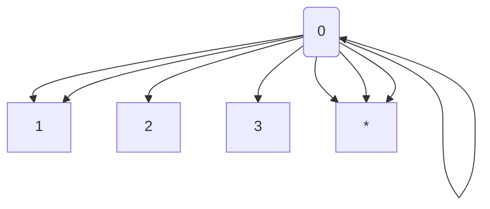

+++
title = "Understanding Lisp: Part 1"
description = "Some notes on the history and origins of the Lisp programming language."
date = "2019-09-29"
categories = ["programming languages","lisp","recursive functions","eval"]
mmark = true
draft = false
+++

<span style="color:red">
*Note: this post is still in progress. When I started writing these notes
several months ago, I quickly realized that it is very difficult to
describe the Lisp language and McCarthy's original paper on Lisp
without going deep into details (during my initial attempt to write a cursory
overview of Lisp, I also realized that there were many
aspects of the language and its history that I never truely
understood). Posting these notes in an unfinished version is meant to
serve as a forcing function to get me to finally finish this article,
since it has remained dormant in the past month.  I hope
that, even in its current unfinished form, it still provides some
interesting insight.*
</span>


I've been slowly making my way  through John McCarthy's seminal paper
on Lisp,  [*Recursive Functions of Symbolic Expressions: Their
Computation by Machine, Part 1*](http://www-formal.stanford.edu/jmc/recursive.pdf). It
was only after a week or so of digesting the content that I started to
understand the significance of his ideas and the broader context within which the Lisp programming language was developed. In this article, I will attempt to summarize what I've learned so far about the history and development of this fascinating programming language.[^1]

In trying to understand the Lisp language and its origins, I think it
helps to ask two separate questions. First, why is a language or a
*formalism* such as Lisp (as we discuss, Lisp is much more than
simply a programming language) needed or desirable? Answering this
question first requires considering the  shortcomings of the
programming languages available at the time when McCarthy started his
work, as well as the theoretical motivations that prompted McCarthy to
work on Lisp in the first place.  These topics are addressed in the
first Section, and center around the topic of **recursive functions
and programming**, which are fundamental to the design and spirit of
Lisp and many subsequent programming languages in the *functional
programming* tradition. The second question is: what is the nature of
the actual Lisp language that McCarthy and his colleagues first
proposed and implemented, and what, if anything, is special about it?
The topic is discussed in the second section, with a focus on the Lisp **eval** function and the idea of **self interpreting code** (both of which were initially theoretical ideas that even McCarthy, at the time of writing his article, didn't realize had many practical applications in programming language design).

# Lisp the Idea

## The Historical Context and Recursive Programs

First, a rather obvious point about the historical context: Lisp was
developed during a time when only a few modern programming languages
existed (specifically, during the late 1950s). The conventional wisdom
is that Lisp is the second oldest programming language in continuous
use behind Fortran. While it's hard to find a readable and concise
code example involving earlier versions of Fortran,  a good starting
point is to consider the following program in a modern version of
Fortran: [^2]
```fortran

PROGRAM MAIN
      INTEGER N, X
      EXTERNAL SUB1
      COMMON /GLOBALS/ N
      X = 0
      PRINT *, 'Enter number of repeats'
      READ (*,*) N
      CALL SUB1(X,SUB1)
      END

      SUBROUTINE SUB1(X,DUMSUB)
      INTEGER N, X
      EXTERNAL DUMSUB
      COMMON /GLOBALS/ N
      IF(X .LT. N)THEN
        PRINT *, 'x = ', X
        X = X + 1
        CALL DUMSUB(X,DUMSUB)
      END IF
      END
```

This program, which takes a given number \texttt{N} from a user prompt
and prints all intermediate numbers using a variable $\texttt{X}$ a
subroutine $\texttt{SUB1}$, is implemented in Fortran 77, which became
the Fortran standard in 1978 (nearly twenty years after Lisp). The
details of this program are not important. What is important is the
part that involves the second argument to $\texttt{SUB1}$ called
$\texttt{DUMSUB}$. When this subroutine is called,  as shown below:
$$
\texttt{CALL SUB1(X,SUB1)}
$$
he second argument is the actual function $\texttt{SUB1}$. As discussed in the article cited above, Fortran 77 (in contrast to later versions of Fortran such as Fortran 90 and 95) does not fully support recursion (i.e., the ability for a function to call itself); a function in Fortran 77 can only make a recursive call if it calls itself as an argument. 


To illustrate recursion a bit more, the code below shows two versions
of this same function in the
[Python programming language](https://www.python.org/), a recursive
version ($\texttt{recursive\_version}$, where the function calls
itself on line 6) and a non-recursive version
($\texttt{non\_recursive\_version}$, which instead uses a while
loop). In the former case, we get rid of the need to change *the
state* or value of the variable $\texttt{x}$, and instead call the
function directly with $\texttt{x + 1}$.
```python
N = 10

def recursive_version(x):
	if x < N: 
        print("x = %d" % x)
	    recursive_version(x+1)
	
def non_recursive_version(x):
    while x < N:
        print("x = %d" % x)
        x += 1

recursive_version(0)
non_recursive_version(0)
```
Casual users of Python may only rarely encounter recursion and instead
choose to always write their functions in the second *iterative* or
*imperative* style (in this case, we mutate the value of $\texttt{x}$
during each pass in the $\texttt{while}$ loop). In fact, there are
good reasons for avoiding recursion in languages such as Python; if
you change the value $\texttt{N}=2000$, for example, Python will raise
a $\texttt{RuntimeError}$ and complain that you have exceeded a
$\texttt{maximum recursion depth}$ (this is related to certain internal
properties of how Python is implemented that we won't delve into here;
see [here](https://realpython.com/python-thinking-recursively/) for a
more general discussion of recursion in Python).

## Recursive Functions: Some Theoretical Perspective

The point of the examples above is that recursion is not an essential
part of classical imperative programming; this is reflected in the
shortcomings of the languages discussed above, languages which  came
into existence  long after McCarthy's initial work on Lisp (case in
point: in Fortran 77, which again came out nearly 20 years after Lisp,
function recursion is not directly supported). In Lisp, however,
recursion is not only well supported, but it is fundamental to the
design and spirit of the language. This is perhaps one main reason why
the language is hard to grasp. What's more, the motivation for using
recursion (especially in McCarthy's original work) is related to
theoretical considerations that are not likely to be understood by
many programmers. This is precisely the topic I intend to explore a
bit more in this section.

Before getting into the theoretical motivations, let's ensure that we
have the correct intuitions about recursion by looking again at an
example in Python.  This example is a naive implementation of the
factorial function $n!$, which takes a positive integer $n$  and
returns the product of $1 \times 2 \times ... \times n$. For example,
$6! = 1 \times 2 \times 3 \times 4 \times 5 \times 6 = 720$.  The
factorial function is a classic recursive function, which can be
expressed as the following *recurrence* (or recursive definition):
$$
n!=n \times (n-1)!
$$
This can be implemented directly in the Python program shown below (again, we have to be careful not to make $N$ too large in order to avoid exceeding the maximum recursion depth):
```python
N = 10

def factorial(n):
    if n == 0:
        return 1
    return n * factorial(n - 1)
    
factorial(N)
```
I find it helpful to visualize the program above (and recursion more
generally) using a tree representation, such as the one shown below
(where  $N=3$):



Here we can see that $\texttt{factorial}$ continues to be called until we reach a  zero point, at which point $1$ is returned ) and  multiplication is incrementally applied over the remaining numbers (or *leaf nodes*) in the tree (i.e., $1,2,3$).  One important thing to observe  is that we have explained away the factorial function in terms of three much simpler operations, namely **multiplication**, **subtraction**  and **returning 1** (or what is sometimes referred to as the $\texttt{constant}$ function). In other words, if we are concerned about whether the factorial function will reliably give us a solution for any number $N$, we can be reassured by seeing through its recursive definition that it relies on these much simpler operations. We can even decompose the multiplication function for positive numbers into a recursive function, as shown below:
```python
def mult(x,y):
    if x == 1: 
    	return y
    return y + mult(x-1, y)
```
which in turn relies on the constant and subtraction functions again and the addition function. If we apply this function to the values $3,4$, the recursive process can be visualized again as a tree, as shown below:


[^1]: Part way through writing this article, I discovered Paul Graham's paper [The Roots of Lisp](http://languagelog.ldc.upenn.edu/myl/llog/jmc.pdf),which has the same goal of understanding *what McCarthy discovered* in his original paper; I have borrowed some of his explanations throughout this paper. I urge readers to look at this paper, which gets much deeper into the details of McCarthy's original code, and specifically the **eval** function and its broader significance in programming (whereas here we focus more on the theoretical ideas that motivated Lisp and the broader historical context).

[^2]: This example is taken from [here](https://sites.esm.psu.edu/~ajm138/fortranexamples.html)


